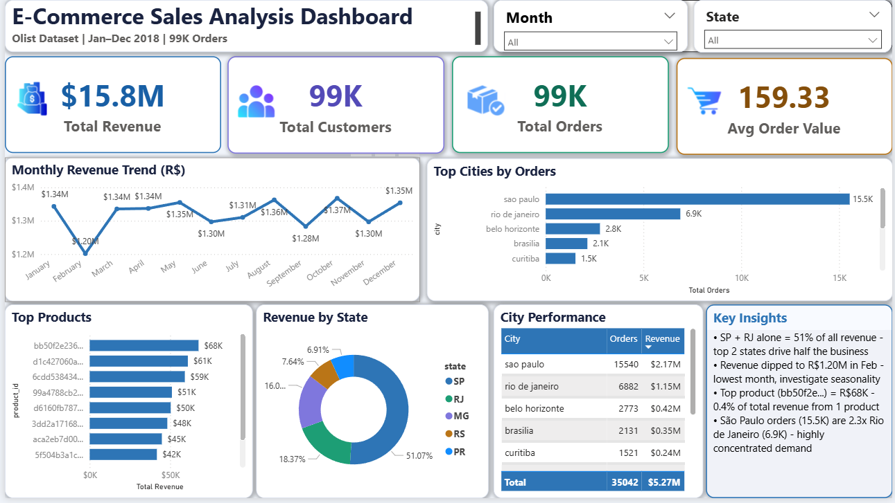

# 📊 E-Commerce Sales Analysis Dashboard
### Power BI · SQL · DAX · Olist Dataset · Jan–Dec 2018

---

> **Analysing 99,000+ orders across Brazil to identify revenue patterns, geographic concentration, and product performance using Power BI.**

---

## 🎯 Project Overview

This project analyses the [Brazilian E-Commerce Public Dataset by Olist](https://www.kaggle.com/datasets/olistbr/brazilian-ecommerce) — a real-world dataset of 99,441 orders placed between January and December 2018 across multiple Brazilian states.

The goal was to build a production-style sales analytics dashboard that answers real business questions:

- Where is revenue concentrated geographically?
- Which products and cities drive the most orders?
- How does revenue trend over time, and when does it dip?
- What is the average order value, and how does it vary?

---

## 📈 Dashboard Screenshot



---

## 🛠️ Tools & Technologies

| Tool | Purpose |
|------|---------|
| **Power BI Desktop** | Dashboard design, visualisation, interactivity |
| **DAX** | KPI measures, conversion calculations, conditional formatting |
| **SQL (MySQL)** | Data cleaning, joins, aggregation, funnel logic |
| **Excel / CSV** | Raw data handling and pre-processing |

---

## 📁 Project Structure

```
ecommerce-sales-dashboard/
│
├── ecommerce-dashboard.pbix       ← Power BI dashboard file
├── ecommerce_analysis.sql         ← SQL queries used for data prep
├── orders_clean.csv               ← Orders data
├── order_items_clean.csv          ← Order items data
├── customers_clean.csv            ← Customers data
├── Dashboard_Screenshot.png       ← Full dashboard screenshot
└── README.md
```

---

## 📊 Dashboard Features

The dashboard is a single-page interactive report with 8 visuals and 2 slicers.

| Visual | Type | What it shows |
|--------|------|---------------|
| Total Revenue | KPI Card | R$ 15.84M — sum of price + freight |
| Total Customers | KPI Card | 99K unique customers |
| Total Orders | KPI Card | 99K distinct orders |
| Avg Order Value | KPI Card | R$ 159.33 per order |
| Monthly Revenue Trend | Line Chart | Revenue by month, Jan–Dec 2018 |
| Top 5 Cities by Orders | Bar Chart | Geographic order concentration |
| Revenue by State | Donut Chart | Top 5 states by revenue share |
| Top 10 Products | Bar Chart | Highest revenue-generating products |
| City Performance | Matrix Table | City × Orders × Revenue |
| Key Insights | Text Panel | 4 data-driven business findings |

**Interactive filters:** Month slicer · State slicer — all visuals update together.

---

## 📐 DAX Measures

```dax
Total Revenue =
SUM(order_items_clean[price]) + SUM(order_items_clean[freight_value])

Total Orders =
DISTINCTCOUNT(orders_clean[order_id])

Total Customers =
DISTINCTCOUNT(customers_clean[customer_id])

Avg Order Value =
DIVIDE([Total Revenue], [Total Orders], 0)

City Share % =
DIVIDE(
    [Total Orders],
    CALCULATE([Total Orders], ALL(customers_clean[customer_city])),
    0
)
```

---

## 🔍 Key Insights

These findings were derived from the dashboard analysis — not visible from the raw data alone:

1. **SP + RJ drive 51% of all revenue.** São Paulo (37.4%) and Rio de Janeiro (13.4%) together account for more than half of total revenue, indicating highly concentrated geographic demand.

2. **Revenue dipped to R$ 1.20M in February** — the lowest month of the year. This aligns with post-holiday seasonality in Brazilian retail and represents a potential window for targeted promotional campaigns.

3. **The top single product (bb50f2e2...) generated R$ 68K**, which equals approximately 0.4% of total revenue from a single SKU. The top 10 products together account for a disproportionate share of revenue — classic Pareto distribution.

4. **São Paulo orders (15.5K) are 2.3× higher than Rio de Janeiro (6.9K)**, despite both being major metropolitan areas. This suggests untapped growth potential in RJ and other large states like MG and RS.

---

## 📈 Dataset Information

| Property | Detail |
|----------|--------|
| Dataset | Brazilian E-Commerce Public Dataset by Olist |
| Source | [Kaggle](https://www.kaggle.com/datasets/olistbr/brazilian-ecommerce) |
| Time Period | January 2018 – December 2018 |
| Total Orders | 99,441 |
| Total Revenue | R$ 15.84M |
| States Covered | 27 Brazilian states |
| Event Types | Orders, Items, Customers, Payments |

---

## 🗄️ SQL Concepts Used

- `JOIN` operations across orders, items, and customers tables
- `GROUP BY` with aggregate functions (`SUM`, `COUNT`, `AVG`)
- `HAVING` clauses for filtered aggregations
- `CASE WHEN` for conditional logic
- Common Table Expressions (CTEs) for multi-step queries
- `RANK()` and `DENSE_RANK()` window functions
- Running totals using `SUM() OVER()`
- Top-N filtering for city and product analysis

---

## 💡 Business Recommendations

**1. Invest in regional expansion beyond SP**
With SP + RJ = 51% of revenue, diversifying into MG, RS, and PR represents the clearest growth lever.

**2. Target February with promotions**
The February revenue dip is consistent and significant. A targeted discount or bundle campaign in late January could soften the drop.

**3. Protect and promote top-10 products**
The top 10 SKUs contribute outsized revenue. Ensuring stock availability and prominent placement for these products has direct revenue impact.

**4. Improve average order value**
At R$ 159.33, there is room to increase AOV through bundle recommendations and free shipping thresholds.

---

## 👤 About

**Role Target:** Data Analyst · Business Intelligence Analyst · Product Analyst

**Skills demonstrated in this project:**
`Power BI` `DAX` `SQL` `Data Visualisation` `KPI Development` `Business Intelligence` `Geographic Analysis` `Dashboard Storytelling`

---

## 📬 Contact

- LinkedIn: [your-linkedin-url]
- Portfolio: [your-portfolio-url]
- Email: [surupawar7971@gmail.com]

---

> ⭐ If you found this project useful, feel free to star the repository!
